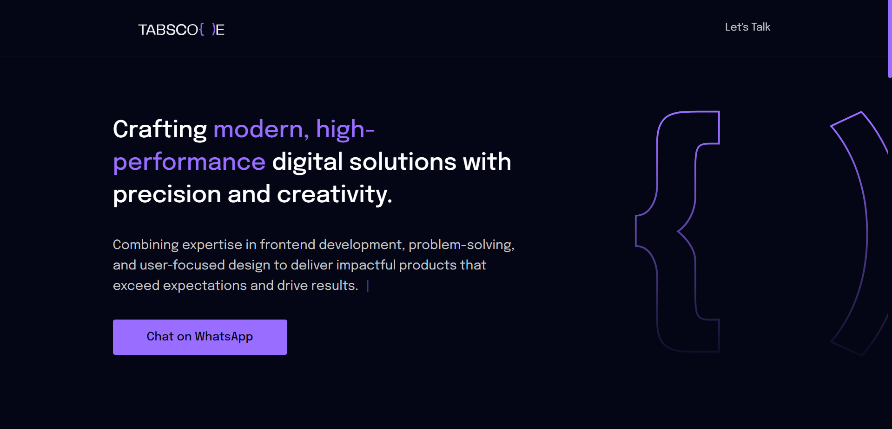

<h1 align="center">
  💻 Portfolio // Mohammad Tabish Farhan
</h1>

<h4 align="center"><a href="https://www.yourportfolio.com/">Click here to visit the project</a></h4>

## 📚 Sections

The website is composed of six sections:

- **Home:** A brief introduction;
- **About Me:** A description telling a bit about who I am;
- **Achievements:** Highlights some notable accomplishments and milestones in my journey;
- **Projects:** Showcases some developed projects with direct links to their respective GitHub repositories;
- **Technical Skills:** Lists and describes the technologies, tools, and frameworks I have expertise in;
- **Skills:** Presents my knowledge in several technologies, with a focus on front-end development;

---

## 💼 Technologies Used

For the development of this website, I used the following technologies:

- HTML  
- Sass  
- JavaScript  

---

## Available for Freelance Work - #OpenToWork 🚀

I am currently open to opportunities as a Frontend Developer and UI/UX Designer.  
If you need someone to turn ideas into beautiful, responsive, and functional interfaces, we can work together!

📬 Contact:  
📧 tabishfarhan853@gmail.com  
💼 [LinkedIn](https://www.linkedin.com/in/md-tabish-farhan/)
